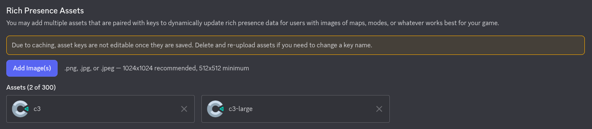

# Discord

Discord Rich Presence allows you to display custom status information for players in their Discord profile, such as the current level, score, or time elapsed.

## Features
- Update activity details and state.
- Show session duration with timestamps.
- Display custom images (large and small) with hover text.

## Setup in Construct 3
If you are using the **Pipelab Construct 3 Plugin**, you can update your Discord status using the dedicated action.

1. **Add the Pipelab Plugin** to your Construct 3 project.
2. **Initialize the integration** using the `Initialize integration` action at the start of your game.
3. Use the **Set activity** action to update the status:

### Action Parameters
The **Set activity** action takes the following parameters:

- **Details**: A description of what the player is doing (e.g., `"Exploring the dungeon"`).
- **State**: The current status of the player (e.g., `"Level 5"` or `"In a party"`).
- **Start Timestamp**: A Unix timestamp (in seconds) representing when the activity started. This is used to display the "elapsed" time.
- **Large image key**: The name of the asset uploaded to the Discord Developer Portal for the large image.
- **Large image text**: The tooltip text shown when hovering over the large image.
- **Small image key**: The name of the asset uploaded to the Discord Developer Portal for the small image.
- **Small image text**: The tooltip text shown when hovering over the small image.

#### Example:
To show that a player is "Exploring the dungeon" on "Level 12", you would call:
- `Set activity("Exploring the dungeon", "Level 12", "1742458171", "main_logo", "My Game Title", "level_icon", "Dungeon")`

::: tip
To get the current timestamp in Construct 3, you can use the expression `floor(Date.Now / 1000)`.
:::

### Configuring Assets
For images to appear in the Rich Presence, you must upload them as **Rich Presence Assets** in the [Discord Developer Portal](https://discord.com/developers/applications):

1. Go to your application in the portal.
2. Navigate to **Rich Presence > Art Assets**.
3. Upload your images and give them names (these will be your **keys**).
4. Use these exact names in the `Large image key` and `Small image key` parameters in Construct 3.

## Testing
To see your Rich Presence in action, ensure that:
1. The Discord desktop app is running.
2. You have enabled **Activity Status** in your Discord user settings (**Settings > Activity Privacy > Display current activity as a status message**).
3. Your game is running via Pipelab.
