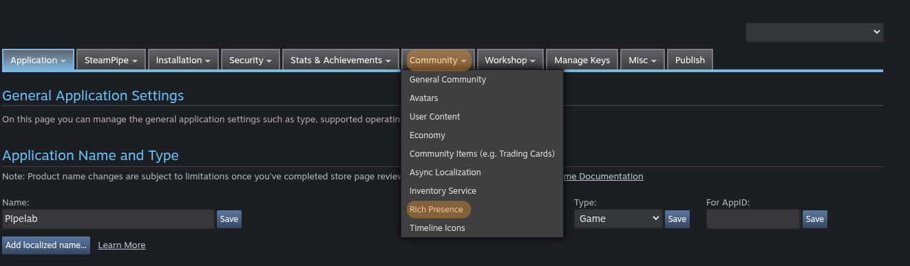

# Steam

## Features
- Automatic project upload

## Upload To Steam
The Upload To Steam task enables you to upload your game to Steam. To proceed, ensure you have the local SDK installed.
Pipelab will automatically log you in if you are already connected through steamcmd; otherwise, it will prompt you for your credentials.

## Rich Presence configuration
Steam Rich Presence allows you to display custom status information for players in their Steam friends list. To set this up, you need to configure a localization file and use the appropriate actions in your game.

### 1. The Localization File
Steam uses a `.vdf` file to define the strings and tokens for Rich Presence. This file must be uploaded to the Steamworks partner site under **App Admin > Community > Rich Presence**.



Here is a basic example of a `localization.vdf` file:

```vdf
"lang"
{
    "Language"  "english"
    "Tokens"
    {
        "#Status_InMenu"    "In the main menu"
        "#Status_Playing"   "Playing on %mapname%"
    }
}
```

- **Tokens**: Keys starting with `#` that will be replaced by the values defined in the file.
- **Variables**: You can use variables like `%mapname%` which can be set dynamically from your game.

### 2. Special Tokens
There are some reserved tokens you should be aware of:
- `steam_display`: This is the main token Steam looks for to determine what to display. It should usually point to another token (e.g., `#Status_Playing`).
- `steam_player_group`: Used to group players together (e.g., in a lobby).
- `steam_player_group_size`: The current size of the player group.

### 3. Setup in Construct 3
If you are using the **Pipelab Construct 3 Plugin**, you can easily update the Rich Presence status using the dedicated action.

1. **Add the Pipelab Plugin** to your Construct 3 project.
2. **Initialize the integration** using the `Initialize integration` action at the start of your game.
3. Use the **Set rich presence** action to update values:
    - **Key**: The name of the token or variable (e.g., `steam_display` or `mapname`).
    - **Value**: The value you want to set (e.g., `#Status_Playing` for `steam_display`, or `The Forest` for `mapname`).

#### Example:
To display "Playing on The Forest", you would call:
- `Set rich presence("steam_display", "#Status_Playing")`
- `Set rich presence("mapname", "The Forest")`

### 4. Testing your configuration
Steam provides a web-based tool to test your Rich Presence configuration without needing to launch your game or upload a build.

You can visit the [Steam Rich Presence Tester](https://steamcommunity.com/dev/testrichpresence) to see how your tokens and variables are being resolved for your account in real-time. This is extremely useful for debugging localization issues or ensuring your variable names match between your game code and your `.vdf` file.

::: tip
Make sure the keys and values you set in your game match the tokens defined in your uploaded `localization.vdf` file.
:::
