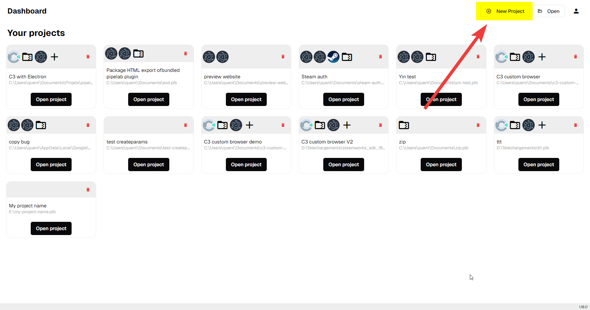
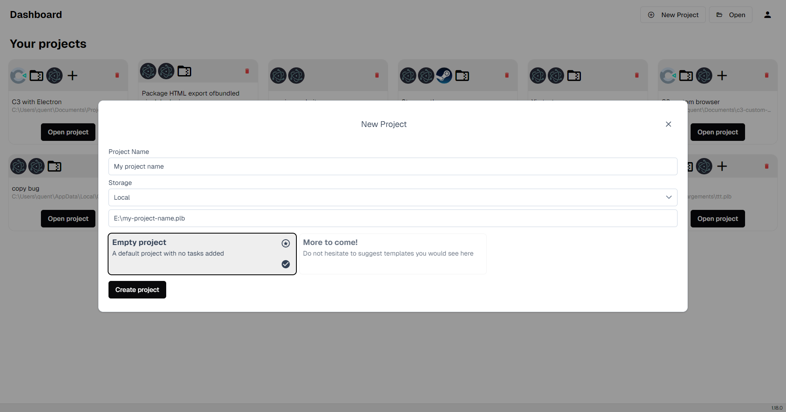
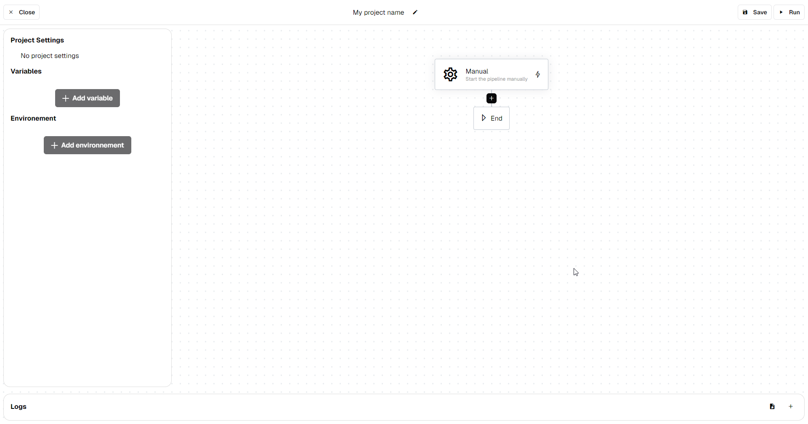
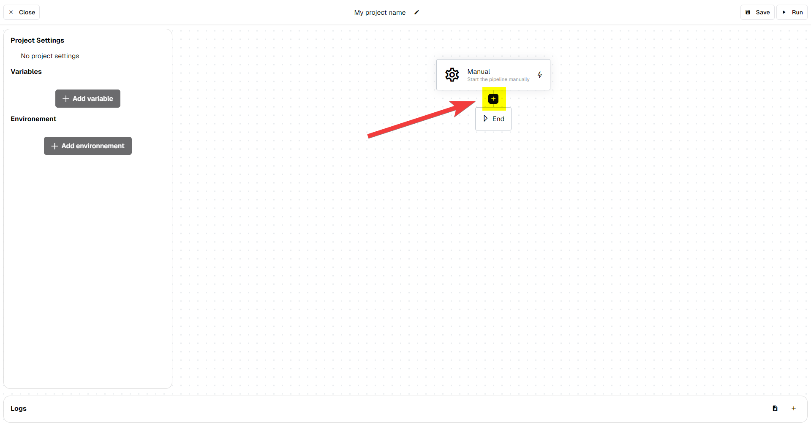
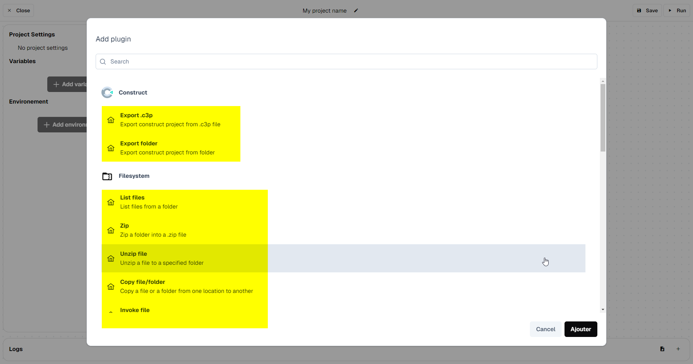
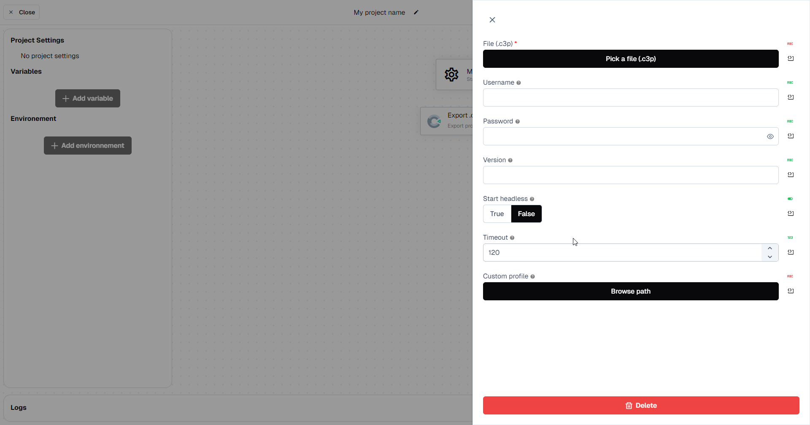
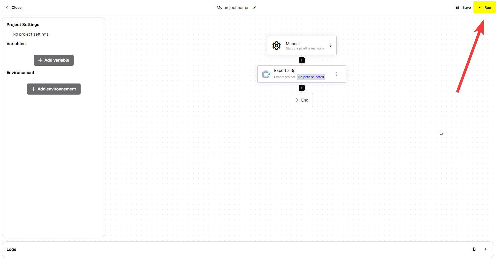
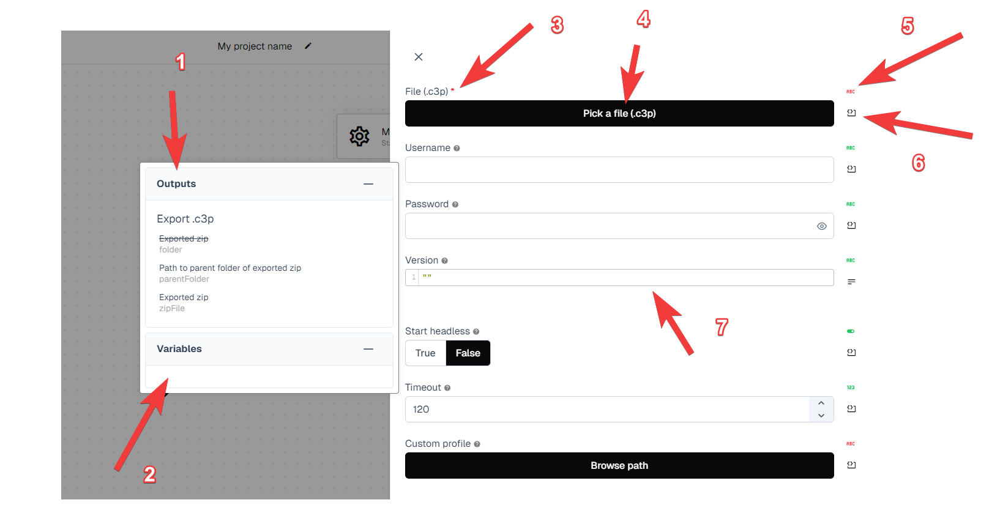
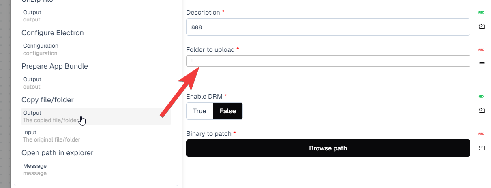
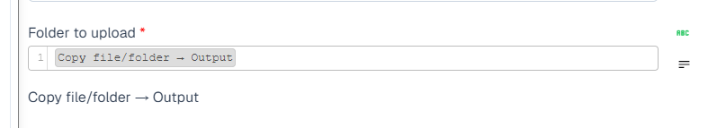

---
next:
    text: 'Integrations'
    link: '/guide/integrations'
---

# Usage
## Basic concepts
Pipelab is based on the concept of **pipelines**. A **pipeline** is a sequence of **tasks** that are executed in order. Each **task** is a unit of work that can be executed independently.
A **pipeline** is triggered by an **event**. An **event** can be a webhook, a cron job, or a manual trigger.

## Editor

Start by creating a new project

A dialog will open to configure your new project.

Once created, the pipeline will open in the editor.

Click on the `+` button to add a new task

Select the task type

Configure the task

You can now run the pipeline

## Configuring tasks

1. This is the Output panel of the [Advanced edit mode](#advanced-edit-mode). It displays all the availabe outputs from previous steps.
2. This is the Variables panel of the [Advanced edit mode](#advanced-edit-mode). It displays all the variables that can be used in the task.
3. This is a regular task's parameter. It can be an input, a boolean, a path selector or more. It can be optional or required.
4. This in an example of a path parameter. It can be used to select a file or a folder.
5. This is an indicator of the parameter's type. You can hover it to know if the type entered in the expected type of the parameter.
6. This button allow to switch between the [Advanced edit mode](#advanced-edit-mode) and the regular edit mode.
7. This is an example of an advanced input.

## Advanced edit mode
This mode allows you to use Javascript to construct the result of the parameter. It is useful when you need to construct a complex parameter from multiple inputs.

### Using the advanced mode
In the example below, we are using the advanced mode to construct the path Steam should upload.

In theory, we want the upload path to be always the output folder of the build step. For this, we'll use the output from the `Copy file/folder` step.

To use it, simply click on it and it will appearin the editor.

The parameter value is calculated from the content of the input. Since it's plain j'avascript, you can construct complex values by concatenating strings, using variables, etc. You can also use ternaries for conditionals.